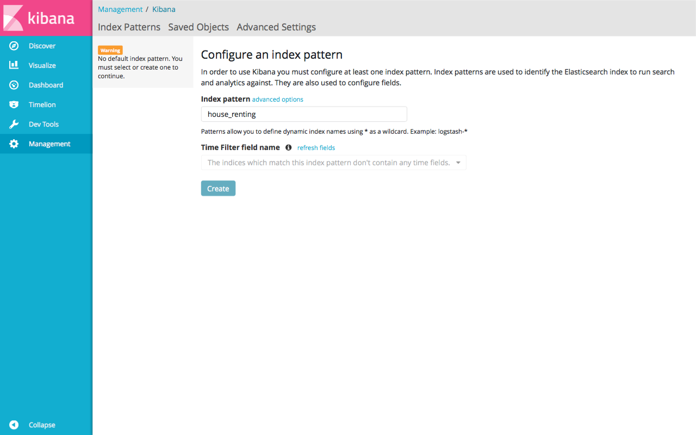
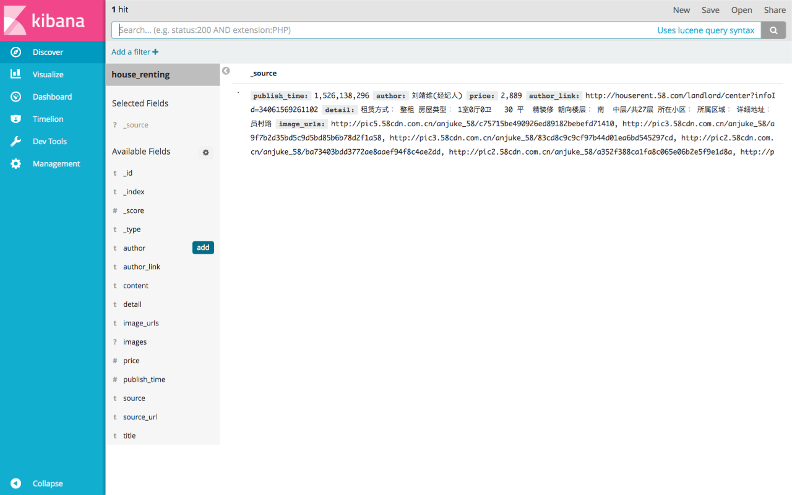
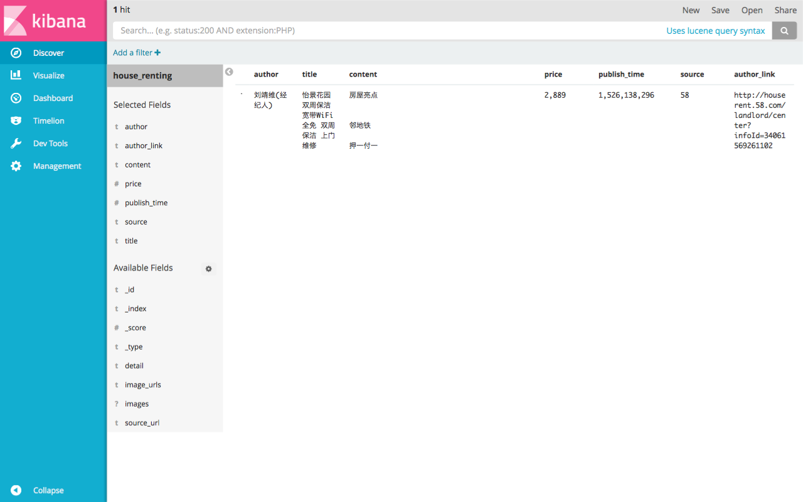
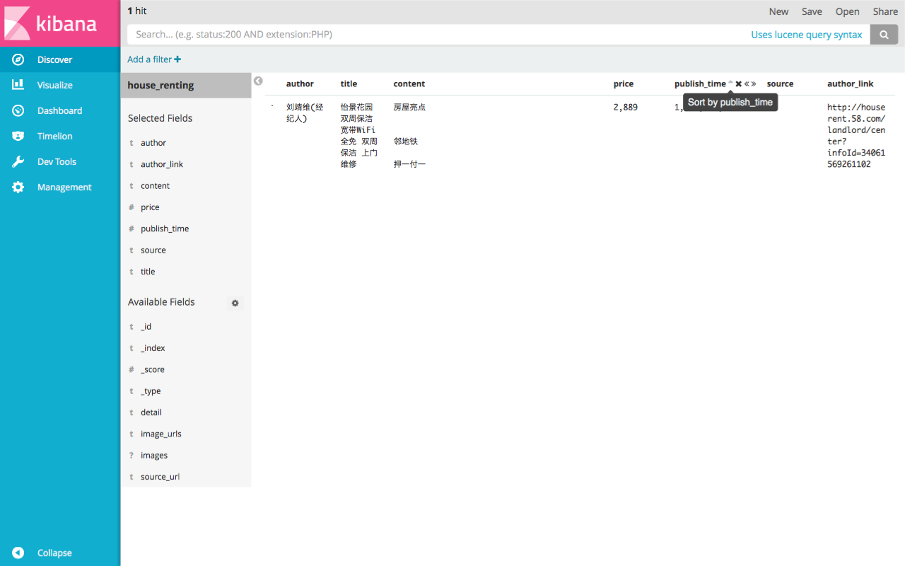
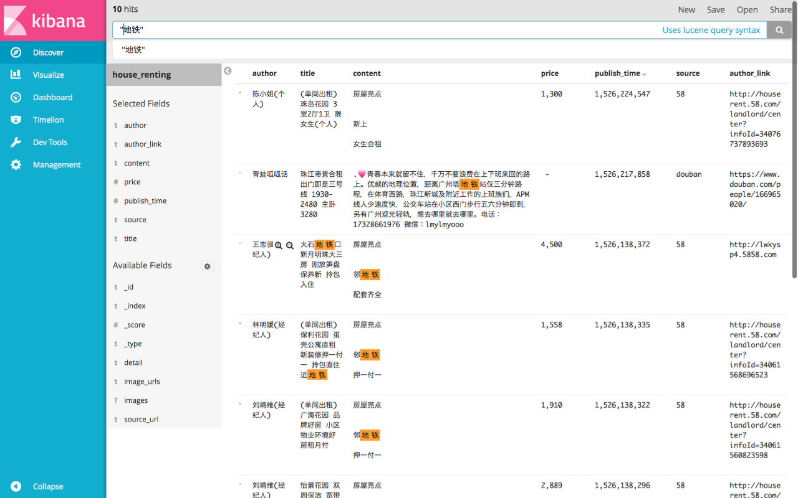
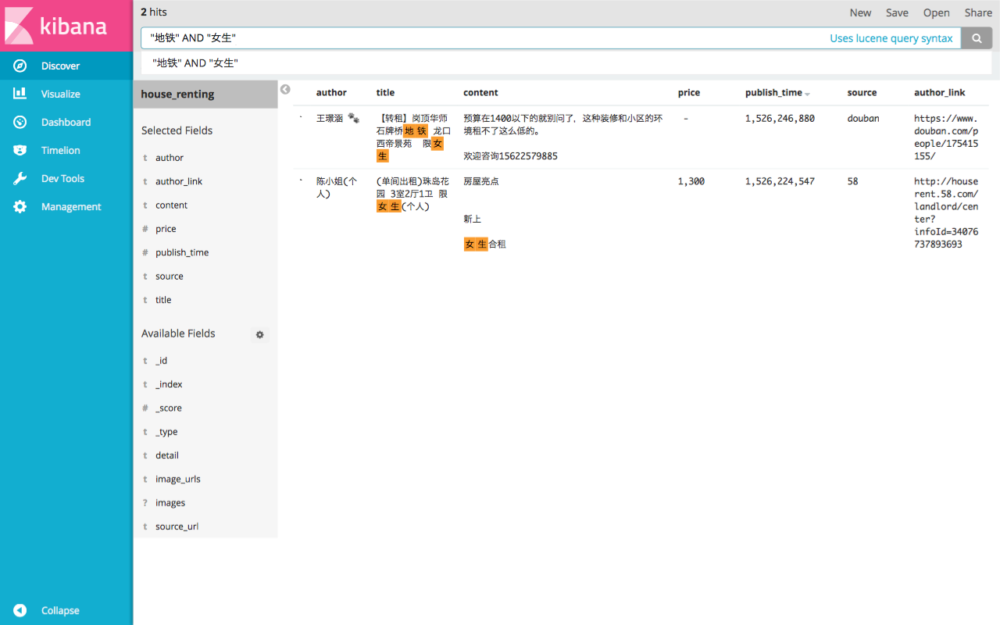
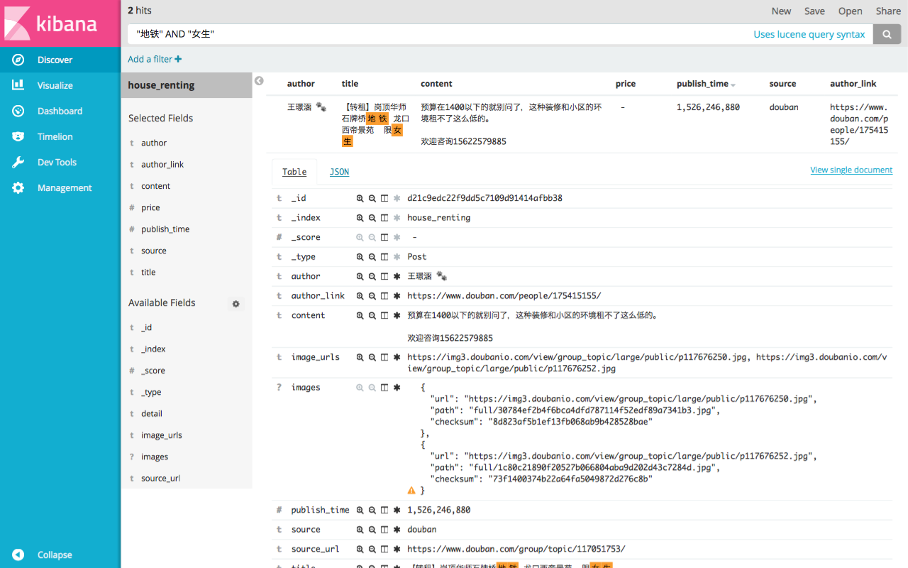

# 租房信息聚合爬虫

**租房信息聚合爬虫**是作者在租房过程中, 由于不堪忍受各个租房网站上各种眼花缭乱的信息而开发的一个基于 [Scrapy](https://scrapy.org) 的爬虫, 作者已经使用该爬虫找到合适的住所; 

为了方便同样身在异乡的朋友解决寻找住处的痛点, 现将该爬虫整理并开源; 目前它聚合了来自[豆瓣](https://www.douban.com), [链家](https://lianjia.com), [58 同城](http://58.com) 等上百个城市的租房信息, 且根据作者的业余时间和精力还在不断更新中; 

将不同网站租房信息聚合起来的优点是: 可以统一集中搜索感兴趣的租房信息, 而不必在各个租房信息网站间来回切换搜索, 还不用受限于部分网站鸡肋的搜索功能;

## 如何使用

为了尽可能满足用户的真实需要和实际使用场景, 作者尽可能利用了各种技术手段来优化本爬虫, 为了方便用户使用该项目, 作者选择使用 Docker 进行部署本项目所需要用到的服务, 但由于 Docker 本身的局限性, 导致在 Windows 非专业版上必须使用 Docker Toolbox 并因此带来了许多问题, 作者已经自己尝试解决过, 但也表示无能为力, 但愿意尽力去帮助解决, 如果你遇到这样的问题, 可以[在这里给提 Issue](https://github.com/kezhenxu94/house-renting/issues), 如果你遇到并自己解决了这样的问题, 欢迎[在这里提 Pull Request](https://github.com/kezhenxu94/house-renting/pulls)帮助优化该项目;

### 安装 Docker

如果你还没有安装 Docker, 请先按照[这里的指南](https://www.docker.com/community-edition#/download)安装 Docker, 在可能的情况下请尽量安装 Docker 而非 Docker Toolbox 或 boot2docker.

### 获取本项目源码:

```shell
$ git clone https://github.com/kezhenxu94/house-renting
```

### 选择要扒取的城市(目前支持链家, 58 同城):

- 选择需要从链家扒取的城市:

打开 `crawler/house_renting/spider_settings/lianjia.py` 文件, 按照注释提示完成城市选择;

```python
# ...
# 只需要在这个列表中添加以下 available_cities 中的城市, 如果只需要扒取一个城市也需要使用一个括号包围, 如 (u'广州')
cities = (u'广州', u'北京')
# ...
```

- 选择需要从 58 同城扒取的城市:

打开 `crawler/house_renting/spider_settings/a58.py` 文件, 按照注释提示完成城市选择;

```python
# ...
# 只需要在这个列表中添加以下 available_cities 中的城市, 如果只需要扒取一个城市也需要使用一个括号包围, 如 (u'广州')
cities = (u'广州', u'北京')
# ...
```

### 启动服务:

```shell
$ cd house-renting
$ docker-compose up --build -d
```

待 Docker 启动稳定后 (视电脑配置情况, 可能需要 30 秒到几分钟不等);

### 查看结果:

打开浏览器, 定位到 http://127.0.0.1:5601 (请根据 Docker 的 IP 相应更改 URL 的地址).

### 设置索引模式:



### 切换到 Discover:



### 添加字段:



### 按时间排序:



### 搜索一个关键字:



### 搜索多个个关键字:



### 展开详细信息:



## 常见问题

> **爬虫扒取信息的速度很慢?**

爬虫扒取网站数据会给网站增加服务压力, 为了避免爬虫频繁扒取被网站封锁, 项目设置了扒取间隔, 可以在文件 `crawler/house_renting/settings.py` 中修改以下几个参数:

```python
DOWNLOAD_DELAY = 10
CONCURRENT_REQUESTS_PER_DOMAIN = 1

AUTOTHROTTLE_ENABLED = True
AUTOTHROTTLE_START_DELAY = 5
AUTOTHROTTLE_MAX_DELAY = 10
AUTOTHROTTLE_TARGET_CONCURRENCY = 1.0
```

各个字段的含义请参看 [Scrapy 文档](https://doc.scrapy.org/en/latest/topics/autothrottle.html);

> **如何不要下载租房信息的图片?**

为了让用户在选择租房的时候, 能够通过先查看房子图片, 后查看租房信息的需求, 本爬虫会把租房信息图片扒取放到本地文件夹 `data/images` 下, 用户可以使用图片浏览器打开该目录下查看图片, 看到合适的房子图片后使用该图片的文件名去 Kibana 搜索, 找到相应的租房信息; 如果不需要该功能, 可以在文件 `crawler/house_renting/settings.py` 中, 将:

```python
ITEM_PIPELINES = {
	'house_renting.pipelines.HouseRentingPipeline': 100,
	'house_renting.pipelines.DuplicatesPipeline': 200,
	'scrapy.pipelines.images.ImagesPipeline': 300,
	'house_renting.pipelines.ESPipeline': 400,
}
```

其中的 `'scrapy.pipelines.images.ImagesPipeline': 300,` 注释掉, 即改成:

```python
ITEM_PIPELINES = {
	'house_renting.pipelines.HouseRentingPipeline': 100,
	'house_renting.pipelines.DuplicatesPipeline': 200,
	# 'scrapy.pipelines.images.ImagesPipeline': 300,
	'house_renting.pipelines.ESPipeline': 400,
}

```
## 贡献

如果你觉得某个租房网站的内容对你非常有用, 应该被收录在这里, 可以[在这里提 Issue](https://github.com/kezhenxu94/house-renting/issues), 或者你自己实现之后[在这里提 Pull Request](https://github.com/kezhenxu94/house-renting/pulls), 帮助更多人找到合适的住所;
